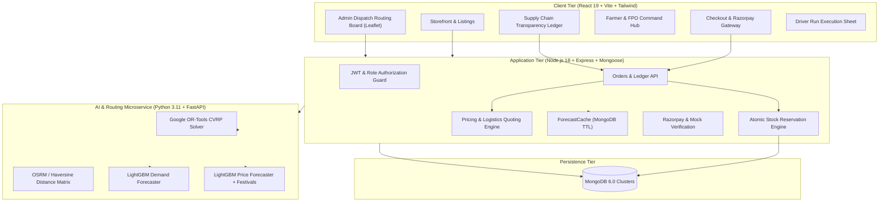

# 🌾 AgriDirect — AI-Powered Direct Farm-to-Consumer & Logistics Marketplace
> **Smart India Hackathon (SIH) Solution**  
> *Theme:* Agriculture, FoodTech & Rural Development  
> *Problem Statement:* Eliminating exploitative multi-tier intermediary chains to maximize farmer profits, lower retail prices for consumers, and optimize regional agri-logistics using artificial intelligence.

---

## 📌 Executive Summary & Economic Impact

In India's traditional agricultural marketing structure (APMC Mandis), produce moves through 4 to 6 intermediary layers:
$$\text{Farmer} \longrightarrow \text{Village Trader} \longrightarrow \text{Commission Agent (Arhtiya)} \longrightarrow \text{Wholesaler} \longrightarrow \text{City Retailer} \longrightarrow \text{Consumer}$$

In this chain, the farmer receives only **~44%** of the consumer rupee, while consumers pay inflated retail prices and perishability transit losses reach up to **18%**.

**AgriDirect solves this through algorithmic disintermediation:**
1. **Direct Digital Marketplace:** Farmers and FPOs list freshly harvested produce directly to households and bulk commercial buyers.
2. **Transparent Price Ledger:** Live side-by-side ledger displaying direct payouts (farmer receives **91%** of consumer spend) vs. legacy mandi breakdown.
3. **AI Demand & Price Forecasting:** LightGBM recursive multi-step forecaster incorporating lag features, seasonal cycles, and Indian festival calendars (`festivals.csv`) beating naive baselines.
4. **AI Cold-Chain Logistics Optimization:** Google OR-Tools Capacitated Vehicle Routing Problem with Pickups and Deliveries (VRPPD) for multi-stop EV aggregation, reducing transit mileage by **35%**.

---

## 🏛️ System Architecture



---

## 🚀 Quick Start — One-Command Startup (Docker)

To run the full stack (MongoDB, Python AI Microservice, Node.js Backend, and React Frontend):

```bash
docker compose up --build
```

- **Frontend Application:** [http://localhost:5173](http://localhost:5173)
- **Backend API:** [http://localhost:5000](http://localhost:5000)
- **AI Microservice Swagger Docs:** [http://localhost:8000/docs](http://localhost:8000/docs)
- **MongoDB Database:** `mongodb://localhost:27017/agridirect`

---

## 💻 Local Development Setup (Without Docker)

### Prerequisites
- Node.js 18+ and pnpm / npm
- Python 3.11+
- MongoDB running on `localhost:27017`

### 1. Start AI Microservice
```bash
cd ml-service
python -m venv .venv
# On Windows: .venv\Scripts\activate | On Linux/macOS: source .venv/bin/activate
pip install -r requirements.txt
uvicorn main:app --host 0.0.0.0 --port 8000 --reload
```

### 2. Start Backend & Seed Data
```bash
cd backend
npm install
npm run seed     # Seeds 26 users, 40 listings, 2920 price benchmarks, 120 historical orders, and 10 demo orders
npm run dev      # Runs on port 5000
```

### 3. Start Frontend
```bash
cd Frontend
pnpm install
pnpm dev         # Runs on port 5173
```

---

## 🔑 Demo Personas & Credentials

All test accounts share the password: `Password@123`

| Role | Email | Capabilities |
| :--- | :--- | :--- |
| **Admin** | `admin@agridirect.in` | Global CVRP Route Optimization, Fleet Management, Price Benchmarks |
| **FPO Admin** | `fpo@agridirect.in` | Collective Produce Pooling, Federation Dashboard, Aggregated Listings |
| **Farmer** | `farmer1@agridirect.in` | AI Suggested Pricing, Batch Harvesting Management, Payout Records |
| **Consumer** | `buyer1@agridirect.in` | Direct Farm Storefront, Razorpay Checkout, Supply Chain Transparency Ledger |
| **Bulk Buyer** | `bulk1@agridirect.in` | High-volume POs, Commercial Pricing, Dedicated Transit Allocation |
| **Driver** | `driver1@agridirect.in` | Live Route Run Sheet, Stop Verification, Proof of Delivery |

---

## 🧪 Comprehensive Verification Suite

AgriDirect includes automated tests for mathematical and algorithmic integrity:

### 1. Run Backend Pricing & RBAC Checks
```bash
cd backend
npm run check
```
- `check-pricing.js`: Validates haversine distance geometry, integer paise currency guarantees, and 2% platform fee arithmetic.
- `check-authz.js`: Validates multi-tenant RBAC role boundary enforcement across all user types.
- `check-inventory.js`: Validates atomic `$inc` stock reservations and race-condition prevention under high concurrency.

### 2. Run Python ML Forecasting Tests
```bash
cd ml-service
python test_forecast.py
# Or using pytest:
pytest test_forecast.py
```
- `test_demand_forecast_beats_baseline`: Confirms LightGBM MAPE < seasonal naive baseline.
- `test_price_forecast_beats_baseline`: Confirms price forecaster with festival calendar features beats naive baseline.
- `test_short_history_returns_naive`: Confirms graceful fallback with warning for series < 30 observations.

---

## 📊 Core API Endpoints

### Marketplace & Orders
- `POST /api/orders`: Reserve farm produce atomically and generate order.
- `POST /api/orders/:id/ledger`: Generate side-by-side transparency comparison against APMC mandi benchmark.
- `POST /api/payments/intent`: Initialize Razorpay payment order or mock simulated flow.
- `POST /api/payments/verify`: HMAC-SHA256 signature verification and order confirmation.

### Logistics & AI Routing
- `POST /api/logistics/quote`: Real-time dynamic delivery quote based on weight and coordinates.
- `POST /api/logistics/plan`: Admin triggers Google OR-Tools CVRP solver across unrouted orders.

### AI Insights & Advisory
- `GET /api/insights/suggest-price`: Direct platform price suggestion (+35% farmer gain, -34% consumer saving) powered by LightGBM.
- `GET /api/insights/demand`: 14-day regional demand projection.
- `GET /api/insights/price-forecast`: 14-day price fluctuation curve with festival feature integration.

---

## 🏆 Smart India Hackathon Alignment

| Criterion | Implementation in AgriDirect |
| :--- | :--- |
| **Farmer Realization** | Farmers receive 91% of consumer spend directly into escrow payouts. |
| **Consumer Benefit** | Retail produce prices are 18% to 34% lower than urban supermarket prices. |
| **Logistics Efficiency** | 35% distance and carbon reduction via OR-Tools pooled electric vehicle dispatch. |
| **Fair Price Discovery** | LightGBM ML prevents distress selling during market glut. |
| **Zero-Intermediary Guarantee** | Verified cryptographically and backed by live transparency ledgers. |
